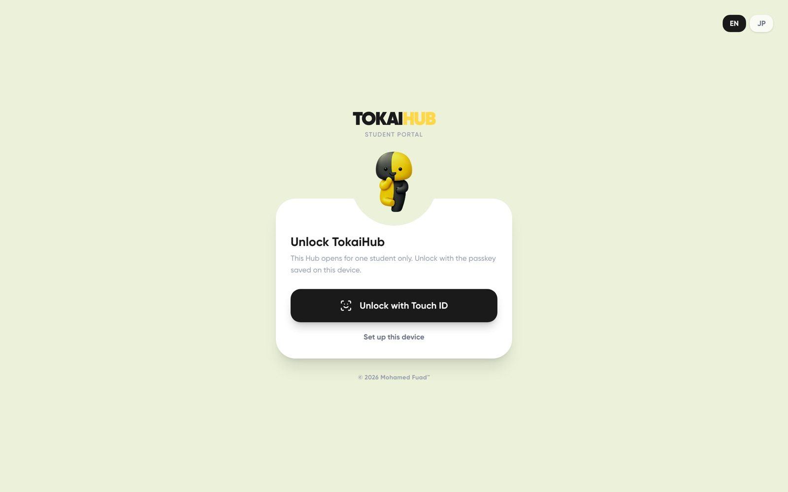

<div align="center">


# TokaiHub

**One place on a phone for the university things a Tokai University student checks every week.**

[](https://tokaihub.mohamedfuad.com/)
[](https://react.dev/)
[](https://tailwindcss.com/)
[](https://vitejs.dev/)
[](https://tokaihub.mohamedfuad.com/)



</div>

---

## Overview

TokaiHub is an installable React PWA in English and Japanese that puts a Tokai
University student's weekly tasks on one phone screen: timetable, courses and
syllabi, grades and credits, attendance, reports and exams, and notices.

**Live:** <https://tokaihub.mohamedfuad.com/>

The data comes from TIPS, the university's own portal (tips.u-tokai.ac.jp). TIPS
has no JSON API; every screen is server-rendered HTML. TokaiHub therefore runs a
small bridge server that signs in to TIPS the way a browser does, parses the
pages, and serves typed JSON to the app. The hosted instance opens for one
student only (the owner) and is unlocked with a passkey saved on the device.

## Features

- **Home and timetable**: today's classes and a weekly timetable for the active
  term, falling back to the other term when the current one has no courses.
- **Course pages**: the full syllabus grouped as TIPS groups it, attached files,
  and one grading panel for every course (weights, grade scale, attendance
  conditions).
- **Grades and credits**: credits earned and credits still needed to graduate.
- **Registration planner**: a "Credits to graduate" panel that subtracts planned
  courses by graduation category.
- **Attendance, reports and exams, notices and the file cabinet**, each read
  from TIPS.
- **Syllabus search** across the catalog.
- **Passkey unlock**: the hosted app talks to the bridge only with the owner's
  device token.
- **English or Japanese, in a light or a dark theme.**

## How It Works

```
React PWA (Vite)
  └─ /tips-api ──▶ bridge: server/index.ts (Express)
                     ├─ tips/session.ts  Microsoft sign-in in a real browser window
                     │                   (Playwright), session kept by the bridge
                     ├─ tips/client.ts   drives TIPS pages inside headless Chromium,
                     │                   one request at a time
                     ├─ tips/parse/*.ts  HTML → typed JSON (cheerio)
                     └─ tips/cache.ts    encrypted cache, so screens paint cached data first
```

- In development the bridge listens on `127.0.0.1:8791`, and the Vite dev server
  proxies `/tips-api` to it for requests from the same machine only.
- In hosted mode a second listener serves the public app. Every data request
  needs the owner's device token, and the TIPS session must belong to
  `HUB_OWNER_ID`.
- Full page-by-page findings: [`docs/tips-integration.md`](docs/tips-integration.md).

## Tech Stack

| Layer | Technology |
| ----- | ---------- |
| Frontend | React 19, TypeScript, Vite, Tailwind CSS 4, React Router, Motion |
| App shell | Installable PWA (web manifest and service worker) |
| Bridge | Node.js, Express, Playwright (Chromium), cheerio |
| Unlock | Passkeys via SimpleWebAuthn |
| Testing | Vitest, `tsc`, ESLint |
| Hosting | Vercel (frontend) |

## Project Structure

```
src/
  App.tsx          # Routes and app-wide settings
  components/      # One file per screen (Tokai*) plus shared pieces
  lib/             # Bridge client, TIPS adapters, grading and syllabus logic, tests
server/
  index.ts         # Bridge entry: local and public listeners
  auth.ts          # Passkey unlock and device tokens
  tips/            # TIPS session, client, parsers and cache
public/            # Manifest, service worker, icons, fonts
scripts/hub.sh     # Start, stop and inspect the hosted bridge
lambdas/           # Earlier AWS backend, no longer called by the app
docs/              # TIPS findings, screenshots
```

## Getting Started

**Prerequisites:** Node.js 22.12 or later (Vitest 5 and ESLint 10 need it) and a
Tokai University TIPS account.

```bash
npm install
npx playwright install chromium   # the bridge signs in through Chromium

npm run bridge   # terminal 1: TIPS bridge on http://127.0.0.1:8791
npm run dev      # terminal 2: app on http://localhost:3000
```

Sign in with Microsoft from the app; the bridge opens a separate Chromium window
for the university login. Bridge settings (`TIPS_BRIDGE_PORT`,
`TIPS_HUB_SESSION_MINUTES` and the hosted-mode variables) are documented in
`.env.example`.

```bash
npm test         # Vitest (pure logic and parsers on synthetic HTML)
npm run lint     # tsc --noEmit
npm run eslint   # ESLint
npm run build    # production build into build/
```

## Deployment

- **Frontend:** Vercel builds `main` into `build/` and serves
  `tokaihub.mohamedfuad.com`. `.env.production` sets the bridge URL.
- **Bridge:** runs on the owner's own machine, managed by `scripts/hub.sh`.

## History

Before September 2026, TokaiHub ran on a serverless AWS backend: Cognito sign-in
with custom forms, API Gateway, Lambda functions and a DynamoDB table. The app
switched to reading TIPS directly, and the Lambda sources stay in `lambdas/` for
reference only.

---

<div align="center">
Built by <a href="https://github.com/MohamedFuad16">Mohamed Fuad</a> · <a href="https://www.mohamedfuad.com">mohamedfuad.com</a>
</div>
